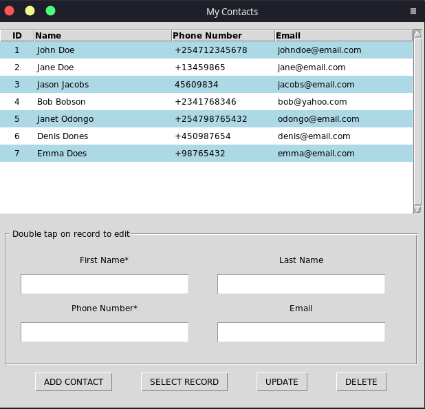

## A contact application using python(tkinter library) and MySQL database



- This application performs all the CRUD operations.

- **NOTE:** Other than selecting an entry then clicking `select` button to allow for editing, you can double click the entry for editing.

- All the code relating to performing database operations are located in `db.py`

## Creating an executable

To avoid constantly running the `python main.py` command to start the application, we will use the `pyinstaller` to generate an executable which will open the application on one click.

To install the library, run

```bash
pip install pyinstaller
```

To create the executable, run:

```bash
pyinstaller --onefile -w main.py
```

In your application folder, new folders namely `dist` and `build` will be created.

The executable will be in the `dist` folder. You can now coppy it to your desktop and run the application with one click
